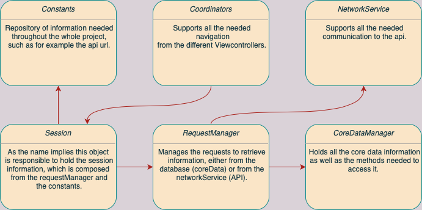

# Forecasty
Forecasty is an app that retrieves country information from an API and presents it in a collection View.

## Features

- MVVM-C architecture
- API Request using URLSession
- CoreData to save the country data in memory
- Logging using os_log
- Unit test to make sure the json decoding is working as expected
- Localization with support for Portuguese and English
- UserDefaults to save the Api key

## Project structure

